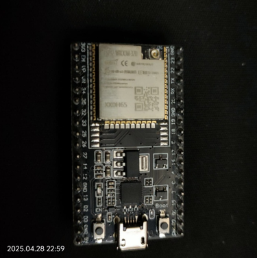
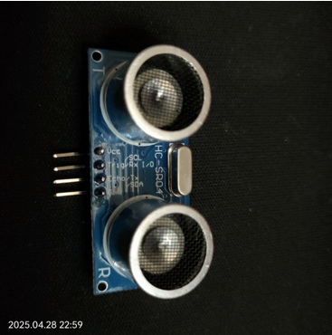
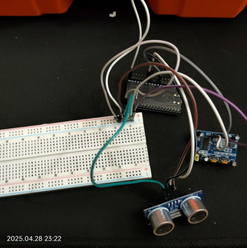

# 📡 Ara Rapor - Hareket Algılayıcılı Güvenlik Sistemi

## 1. Proje Konusu

**Hareket algılandığında kullanıcıya anlık bildirim gönderen bir güvenlik sistemi tasarlamak.**

Proje, IoT tabanlı basit ama etkili bir güvenlik sistemidir. Hedef, bir ortamda hareket algılandığında kullanıcının anında haberdar edilmesini sağlamak ve bu sayede fiziksel güvenliği artırmaktır.

---

## 2. Özet

Bu proje kapsamında, **ESP32 mikrodenetleyicisi** ve **PIR hareket sensörü** kullanılarak çevredeki hareketlerin algılanması sağlanmıştır. Algılanan hareket, **Telegram API** aracılığıyla kullanıcıya **anlık olarak bildirilir**.

ESP32, Wi-Fi aracılığıyla internete bağlanmakta ve belirlenen Telegram kullanıcısına mesaj göndererek hareket hakkında bilgi vermektedir. Sistem düşük maliyetli bileşenlerle kurulabilir ve esnek biçimde genişletilebilir.

---

## 3. Kullanılan Yöntemler

Bu projede hareket algılama, internet üzerinden bildirim gönderme ve mikrodenetleyici ile haberleşme işlemleri gerçekleştirilmiştir. Kullanılan yöntemler şu şekildedir:

### 📦 Donanım Bileşenleri

#### ESP32-WROOM-32U Mikrodenetleyici
- Wi-Fi ve Bluetooth desteklidir.  
- 32-bit çift çekirdekli işlemci ile yüksek performans sunar.  
- 3.3V çalışma voltajına sahiptir.

### ESP32 Modülü

#### PIR (Pasif İnfrared) Sensör
- Sıcaklık farkı ile insan hareketini algılar.  
- Statik nesnelere duyarsızdır; yalnızca hareket eden sıcaklık farkına duyarlıdır.  
- Hareket algılandığında dijital çıkış verir.

### PIR Sensörü

#### HC-SR04 Ultrasonik Mesafe Sensörü
- Trig piniyle ses dalgası gönderilir.  
- Echo piniyle yankı süresi alınır.  
- **Mesafe = (Süre × 0.034) / 2** formülüyle hesaplama yapılır.  
- (Henüz kullanılmadı, sadece bağlantı sağlandı.)

### HC-SR04 Mesafe Sensörü

---

### 💻 Yazılım ve Geliştirme Araçları

#### Arduino IDE
- Kod geliştirme ve ESP32’ye yükleme için kullanıldı.

#### C++ (Arduino Dili)
- Sensör okuma, Wi-Fi bağlantısı ve Telegram API entegrasyonu bu dille yazıldı.

#### WiFiClientSecure Kütüphanesi
- HTTPS bağlantı için gereklidir.  
- `client.setInsecure()` ile SSL sertifikası geçici olarak devre dışı bırakılmıştır.

#### Telegram Bot API
- `https://api.telegram.org/bot<TOKEN>/sendMessage` endpoint'i üzerinden çalışır.  
- Bot token ve kullanıcı chat ID’si ile doğrudan mesaj gönderimi yapılır.

---

### 🌐 İletişim ve Bildirim Yöntemi

- **Wi-Fi bağlantısı:** ESP32 belirlenen SSID ve şifre ile internete bağlanır.  
- **Telegram API entegrasyonu:** Hareket algılandığında Telegram mesajı gönderilmeye çalışılır.  
- `client.connect` ve `client.print()` fonksiyonları kullanılır.

### Devre Bağlantısı

---

## 5. Elde Edilen Sonuçlar

Proje kapsamında şu ana kadar aşağıdaki adımlar başarıyla gerçekleştirilmiştir:

- ✅ **ESP32 mikrodenetleyici**, Arduino IDE üzerinden başarıyla programlandı.
- ✅ **PIR hareket sensörü**, çevresel hareketleri doğru şekilde algılayarak ESP32 ile haberleşti.
- ⚠️ **HC-SR04 ultrasonik mesafe sensörü**, donanımsal olarak bağlandı ancak henüz yazılım entegrasyonu yapılmadı. (Mesafe değerleri okunmadı, kod yazımı eksik.)
- ✅ ESP32, belirlenen Wi-Fi ağına bağlanmakta ve **seri port** üzerinden bağlantı durumu başarıyla izlenebilmektedir.
- ✅ Telegram API için gerekli **mesaj gönderme kodu** yazıldı ve bağlantı denemeleri yapılmaya başlandı.
- ⚠️ **Telegram bildirimleri** şu an için başarıyla gönderilememektedir. Kod yapısı doğru görünmesine rağmen mesajlar API üzerinden iletilmiyor.
  - Sorunun; `token`, `client.connect()` bağlantısı veya SSL doğrulama kaynaklı olabileceği düşünülmektedir.
  - **Hata ayıklama (debugging)** çalışmaları devam etmektedir.

---

## 6. Karşılaşılan Sorunlar ve Çözümler

### 🛠️ 6.1 Telegram API Bildirim Sorunu

- **Sorun:** Telegram bot üzerinden mesaj gönderimi gerçekleşmiyor.
- **Sebep Adayları:**
  - `client.connect()` başarısızlığı
  - Hatalı veya geçersiz `bot token`
  - SSL sertifika doğrulaması (ESP32'de yaygın bir sorun)
- **Geçici Çözüm:** `client.setInsecure()` komutu ile SSL sertifika kontrolü devre dışı bırakıldı (güvenlik açığı yaratabilir).
- **Durum:** Sorun henüz çözülmedi. Kod ve bağlantı detayları üzerinde ileri düzey test ve hata ayıklama yapılması planlanmaktadır.

### 🛠️ 6.2 ESP32 Bağlantı ve Yükleme Sorunu

- **Sorun:** Arduino IDE, başlangıçta ESP32 cihazını tanımadı ve “bağlantı başarısız” hatası verdi.
- **Çözüm:**
  - Gerekli **USB-SERIAL sürücüleri (CP2102/CH340)** indirildi ve kuruldu.
  - Kurulumdan sonra cihaz Arduino IDE tarafından tanındı ve kod başarıyla yüklendi.

---

## 🔑 Anahtar Kelimeler

`ESP32`, `PIR sensör`, `HC-SR04`, `Telegram API`, `IoT`, `Arduino`, `Wi-Fi`, `Güvenlik Sistemi`, `Anlık Bildirim`

